# Examen Final DevOPS - COODIGO

------------------------------------------
## Pruebas de Backend entregado -  Localhost
------------------------------------------

### 1. 📌Crear github > https://github.com/JesusRamirezGamarra/backend-dynamic-db y Crear estructucturas de Ramas 
- develop
- jenkins
- modificador

```
git init
git checkout -b develop
-- Creo archivo readme.md
git add .
git commit -m "add readme.md"
git push origin develop
...
git checkout -b develop
git add .
git commit -m "add readme.md"
git push origin jenkins
...
git checkout -b develop
git add .
git commit -m "add readme.md"
git push origin modificador
```

### 2. 📌sobre la rama develop creo el archivo 
Dockerfile
.dockerignore

agrego sobre el archivo .dockerignore directorios que no se deberan considerar.
agrego sobre el archivo Dockerfile la creacion de la imagen
```
# Usar una imagen base oficial de Node.js
FROM node:18

# Establecer el directorio de trabajo en el contenedor
WORKDIR /app

# Copiar los archivos del proyecto al contenedor
COPY package*.json ./

# Instalar las dependencias
RUN npm install

# Copiar el resto del código de la aplicación
COPY . .

# Exponer el puerto en el que correrá la aplicación
EXPOSE 3000

# Definir la variable de entorno por defecto para la base de datos (puede ser sobrescrita)
ENV MY_DATABASE_DRIVER=mysql

# Comando para ejecutar la aplicación
CMD ["node", "index.js"]
```
agrego el proyecto Backend compartido por el profesor

Ejecuto en la terminal :
verifico tener iniciado DockerDesktop y haber iniciado session en Dockerhub
```
docker build -t jesusramirezgamarra/backend-dynamic-db:latest .
```
    verificar que exista el package.json
    ls -l package.json
    verificar limpiar cache de builds anteriores en caso de errores previos.
    docker build --no-cache -t jesusramirezgamarra/backend-dynamic-db:latest .
```
docker images
```
    verificar que se creo de forma correcta la imagen : jesusramirezgamarra/backend-dynamic-db 
```
docker inspect jesusramirezgamarra/backend-dynamic-db:latest   
```
    verificar variables de entorno(ENV),rutas de trabajo (WorkingDir) y Exposicion de puertos(ExposedPort)

en este punto puedo publicar la imagen en mi docker-hub
```
docker login
docker push jesusramirezgamarra/backend-dynamic-db:latest
```


puedo visualizar desde un navegador y confirmar la publicacion de la imagen 
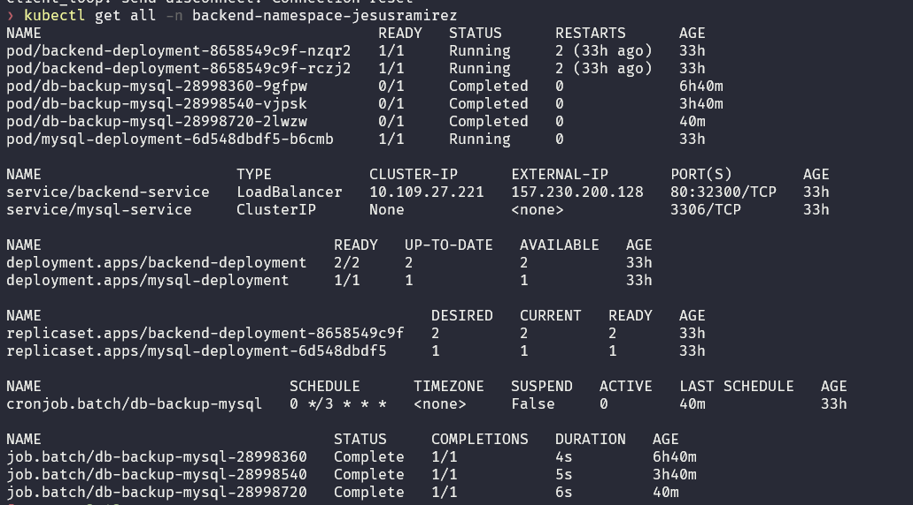


## 3. 📌Antes de continuar verifico el comportamiento de la Imagen en local 
Analizo que por lo pronto necesito 2 servicios ( MySQL or Base de datos y otro para el Backend) al tener planteado 2 servicios logicamente requiero que esten en la misma red para que tengan comunicacion  


Servicio	                Nombre Sugerido
Base de datos MySQL	        mysql-db
Base de datos PostgreSQL	postgres-db
Base de datos MongoDB	    mongo-db
Backend API en Node.js	    backend-api
red                         backend-network

Creo el archivo docker-compose.yml
agrego 2 servicios y 1 red 
```
version: '3.8'

services:
  mysql-db:
    image: mysql:latest
    container_name: mysql-db
    restart: always
    environment:
      MYSQL_ROOT_PASSWORD: 123456
      MYSQL_DATABASE: testdb
      # MYSQL_USER: root
      # MYSQL_PASSWORD: 123456
    ports:
      - "3306:3306"
    volumes:
      - mysql-data:/var/lib/mysql
    networks:
      - backend-network
  backend-api:
    image: jesusramirezgamarra/backend-dynamic-db:latest
    container_name: backend-api
    restart: always
    depends_on:
      - mysql-db
    environment:
      MY_DATABASE_DRIVER: mysql
      DB_HOST: mysql-db
      DB_USER_NAME: root
      DB_PASSWORD: 123456
      DB_NAME: testdb
      DB_PORT: 3306
    ports:
      - "3000:3000"
    networks:
      - backend-network

networks:
  backend-network:
    driver: bridge

volumes:
  mysql-data:
```
Inicio los servicios hahiendo definido el estandar de nombre y al menos los servicios iniciales
```
docker-compose up -d
```
    Es importante entender que en esta etapa de verificacion para editar  re regenerar el servcicio podemos recurrir a 
    ```
    docker-compose up --build -d
    ```
    Auqnue en muchos de los casos es preferir detener y regresar todo indicando --no-cache

ejecutamos ara confirmar que nuestros servicios estan en ejecucion con los nombres que coloicamos 
```
docker ps
```

visualizo el Log del servicio : mysql-db
```
docker logs mysql-db
```
```
2025-02-15 07:43:21+00:00 [Note] [Entrypoint]: Entrypoint script for MySQL Server 9.2.0-1.el9 started.
2025-02-15 07:43:21+00:00 [Note] [Entrypoint]: Switching to dedicated user 'mysql'
2025-02-15 07:43:21+00:00 [Note] [Entrypoint]: Entrypoint script for MySQL Server 9.2.0-1.el9 started.
2025-02-15 07:43:21+00:00 [ERROR] [Entrypoint]: MYSQL_USER="root", MYSQL_USER and MYSQL_PASSWORD are for configuring a regular user and cannot be used for the root user
```
    Remove MYSQL_USER="root" and use one of the following to control the root user password:
    - MYSQL_ROOT_PASSWORD
    - MYSQL_ALLOW_EMPTY_PASSWORD
    - MYSQL_RANDOM_ROOT_PASSWORD

Al analizar el log entiendo las indicaciones y modifico mi archivo Docker-compose.yaml 
```
docker-compose down --volumes
docker-compose up -d
docker logs mysql-db
```
```
2025-02-15 07:49:59+00:00 [Note] [Entrypoint]: Entrypoint script for MySQL Server 9.2.0-1.el9 started.
2025-02-15 07:50:00+00:00 [Note] [Entrypoint]: Switching to dedicated user 'mysql'
2025-02-15 07:50:00+00:00 [Note] [Entrypoint]: Entrypoint script for MySQL Server 9.2.0-1.el9 started.
2025-02-15 07:50:00+00:00 [Note] [Entrypoint]: Initializing database files
2025-02-15T07:50:00.763104Z 0 [System] [MY-015017] [Server] MySQL Server Initialization - start.
2025-02-15T07:50:00.765356Z 0 [System] [MY-013169] [Server] /usr/sbin/mysqld (mysqld 9.2.0) initializing of server in progress as process 80
2025-02-15T07:50:00.779156Z 1 [System] [MY-013576] [InnoDB] InnoDB initialization has started.
2025-02-15T07:50:01.352117Z 1 [System] [MY-013577] [InnoDB] InnoDB initialization has ended.
2025-02-15T07:50:02.794408Z 6 [Warning] [MY-010453] [Server] root@localhost is created with an empty password ! Please consider switching off the --initialize-insecure option.
2025-02-15T07:50:05.434838Z 0 [System] [MY-015018] [Server] MySQL Server Initialization - end.
2025-02-15 07:50:05+00:00 [Note] [Entrypoint]: Database files initialized
2025-02-15 07:50:05+00:00 [Note] [Entrypoint]: Starting temporary server
2025-02-15T07:50:05.600871Z 0 [System] [MY-015015] [Server] MySQL Server - start.
2025-02-15T07:50:05.854463Z 0 [System] [MY-010116] [Server] /usr/sbin/mysqld (mysqld 9.2.0) starting as process 123
2025-02-15T07:50:05.887143Z 1 [System] [MY-013576] [InnoDB] InnoDB initialization has started.
2025-02-15T07:50:06.247317Z 1 [System] [MY-013577] [InnoDB] InnoDB initialization has ended.
```
visualizo el Log del servicio : backend-api
```
docker logs backend-api
```

```
Error: connect ECONNREFUSED 172.21.0.2:3306
    at Object.createConnection (/app/node_modules/mysql2/promise.js:253:31)
    at MySQLDriver.connect (/app/drivers/mysqlDriver.js:9:39)
    at /app/index.js:23:18
    at Object.<anonymous> (/app/index.js:50:3)
    at Module._compile (node:internal/modules/cjs/loader:1364:14)
    at Module._extensions..js (node:internal/modules/cjs/loader:1422:10)
    at Module.load (node:internal/modules/cjs/loader:1203:32)
    at Module._load (node:internal/modules/cjs/loader:1019:12)
    at Function.executeUserEntryPoint [as runMain] (node:internal/modules/run_main:128:12)
    at node:internal/main/run_main_module:28:49 {
  code: 'ECONNREFUSED',
  errno: -111,
  sqlState: undefined
}

Error: Table 'testdb.usuarios' doesn't exist
    at PromiseConnection.execute (/app/node_modules/mysql2/promise.js:112:22)
    at MySQLDriver.getAllUsers (/app/drivers/mysqlDriver.js:20:46)
    at /app/index.js:30:36
    at Layer.handle [as handle_request] (/app/node_modules/express/lib/router/layer.js:95:5)
    at next (/app/node_modules/express/lib/router/route.js:149:13)
    at Route.dispatch (/app/node_modules/express/lib/router/route.js:119:3)
    at Layer.handle [as handle_request] (/app/node_modules/express/lib/router/layer.js:95:5)
    at /app/node_modules/express/lib/router/index.js:284:15
    at Function.process_params (/app/node_modules/express/lib/router/index.js:346:12)
    at next (/app/node_modules/express/lib/router/index.js:280:10) {
  code: 'ER_NO_SUCH_TABLE',
  errno: 1146,
  sql: 'SELECT * FROM usuarios',
  sqlState: '42S02',
  sqlMessage: "Table 'testdb.usuarios' doesn't exist"
}

Node.js v18.20.6
Server corriendo en el puerto 3000
/app/node_modules/mysql2/promise.js:112
    const localErr = new Error();
```

Al ver el error me doy cuenta que no existe la tabla usuarios qque menciona el logs pero lo re confirmo solo para estar 100% seguros antes de anadirlo en mi script para que lo haga automatico
```
docker exec -it mysql-db mysql -uroot -p123456
SHOW DATABASES;
USE testdb;
SHOW TABLES;
```
visualizo :
```
Empty set (0.00 sec)
```

salgo con Ctrl + z e ingreso a mi docker-compose.yml y confirmo que no considere agregar el entry point para que ejecute el script q crea objetos iniciales y tomo nota para como deberia funcionar cuando deba de hacer el cambio de BD en un futuro.
    volumes:
    ```
      - ./data/mysql_data.sql:/docker-entrypoint-initdb.d/init.sql      
    ```  
quedando ahora el docker-compose.yaml de la siguiente forma :
```
version: '3.8'

services:
  mysql-db:
    image: mysql:latest
    container_name: mysql-db
    restart: always
    environment:
      MYSQL_ROOT_PASSWORD: 123456
      MYSQL_DATABASE: testdb
      # MYSQL_USER: root
      # MYSQL_PASSWORD: 123456
    ports:
      - "3306:3306"
    volumes:
      - mysql-data:/var/lib/mysql
      - ./data/mysql_data.sql:/docker-entrypoint-initdb.d/init.sql      
    networks:
      - backend-network
  backend-api:
    image: jesusramirezgamarra/backend-dynamic-db:latest
    container_name: backend-api
    restart: always
    depends_on:
      - mysql-db
    environment:
      MY_DATABASE_DRIVER: mysql
      DB_HOST: mysql-db
      DB_USER_NAME: root
      DB_PASSWORD: 123456
      DB_NAME: testdb
      DB_PORT: 3306
    ports:
      - "3000:3000"
    networks:
      - backend-network

networks:
  backend-network:
    driver: bridge

volumes:
  mysql-data:
```

Bajo el servicio para que se eliminen y recreo nuevamente.    
```
docker-compose down
docker-compose up -d
```

Verifico la existencia de mi tabla Usuarios
```
docker exec -it mysql-db mysql -uroot -p123456
SHOW DATABASES;
USE testdb;
SHOW TABLES;
+------------------+
| Tables_in_testdb |
+------------------+
| usuarios         |
+------------------+
1 row in set (0.00 sec)
```
Con esta confirmacion sobre la existencia de la tabla Usuarios y que tiene tambien 1 rows verifico sobre mi navegador que el Server corriendo en el puerto 3000
```
http://localhost:3000/
```
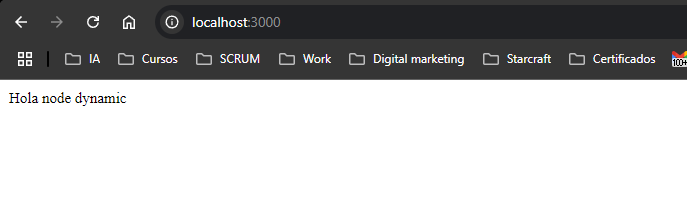
```
http://localhost:3000/users
```

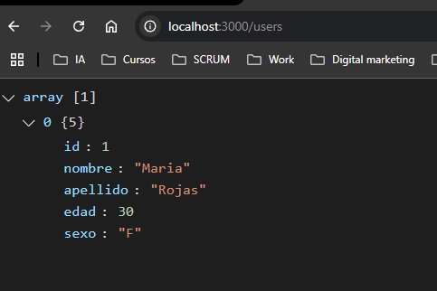

utilizando POSTMAN valido los metodos del backend 
```
GET : http://localhost:3000/users/
```
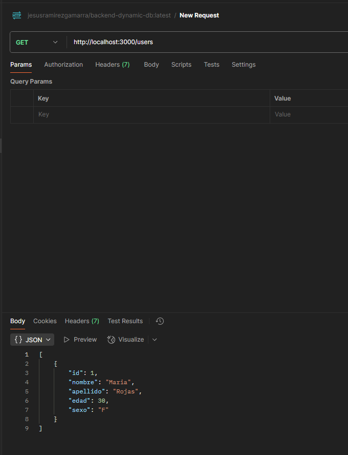
```
GET : http://localhost:3000/users/1
```
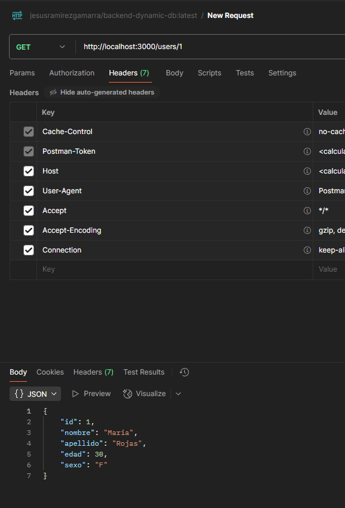
```
POST : http://localhost:3000/users/
```
Body raw JSON
```
{
    "nombre": "Jesus",
    "apellido": "Ramirez",
    "edad": "40",
    "sexo": "M"
}
```
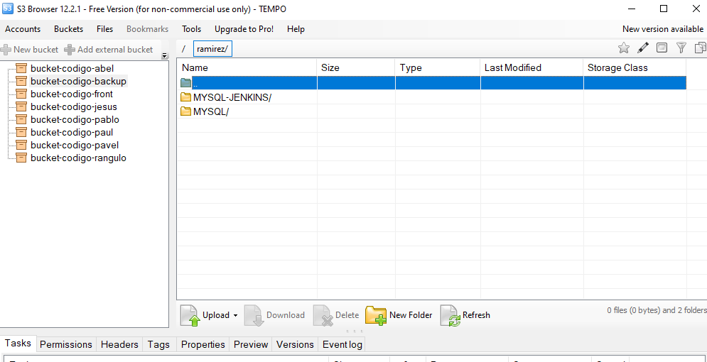


------------------------------------------
## Para la rama “develop” con Github actions
------------------------------------------
### 1 .📌 conectarme a digital ocean, validar conexion y confirmas uso de minikube 
```
ssh root@204.48.22.13
apt update && apt install -y apt-transport-https ca-certificates curl
```
    ```
    apt update
    ```
        Actualiza la lista de paquetes disponibles en el sistema. Se asegura de que el servidor tenga la información más reciente sobre los paquetes
    ```
    apt install -y apt-transport-https ca-certificates curl
    ```
        apt-transport-https → Permite descargar paquetes a través de HTTPS.
        ca-certificates → Instala certificados necesarios para verificar la autenticidad de las conexiones.
        curl → Es una herramienta para hacer peticiones HTTP y descargar archivos.
```
curl -fsSL https://packages.cloud.google.com/apt/doc/apt-key.gpg | apt-key add -
```
    ```
    curl -fsSL https://packages.cloud.google.com/apt/doc/apt-key.gpg
    ```
        Descarga la clave GPG de Google para verificar la autenticidad de los paquetes.
    ```
    | apt-key add -
    ```
        Agrega la clave GPG al sistema para que los paquetes de Google sean considerados seguros.

```
echo "deb https://apt.kubernetes.io/ kubernetes-xenial main" | tee /etc/apt/sources.list.d/kubernetes.list
```
    ```
    echo "deb https://apt.kubernetes.io/ kubernetes-xenial main"
    ```
        Agrega el repositorio oficial de Kubernetes para Ubuntu/Debian.
    ```
    | tee /etc/apt/sources.list.d/kubernetes.list
    ```
        Guarda el repositorio en un archivo en /etc/apt/sources.list.d/, permitiendo que apt lo use.
```        
apt update
apt install -y kubectl
kubectl version --client
```
No apt package "kubectl", but there is a snap with that name.
Try "snap install kubectl"

```
which kubectl
```
    como no tube respuesta al intentar de hacer un Which, proceso a instalarlo desde el repo por default :

```
curl -LO "https://dl.k8s.io/release/$(curl -L -s https://dl.k8s.io/release/stable.txt)/bin/linux/amd64/kubectl"
chmod +x kubectl
mv kubectl /usr/local/bin/
```
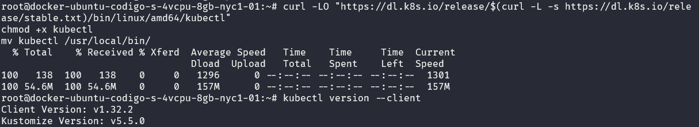

```
minikube start
```
  command 'minitube' from deb minitube (3.9.1-1)
Try: apt install <deb name>
```
root@docker-ubuntu-codigo-s-4vcpu-8gb-nyc1-01:~# curl -LO https://storage.googleapis.com/minikube/releases/latest/minikube-linux-amd64
```
```
sudo install minikube-linux-amd64 /usr/local/bin/minikube
```

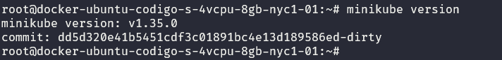

```
kubectl version --client
```
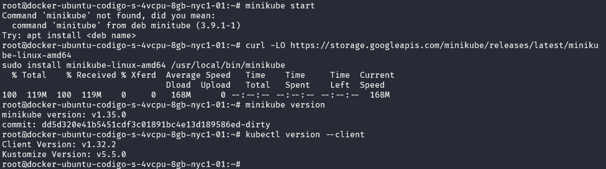

Confirmando que tengo intalado Minikube
```
minikube start
kubectl get nodes
```

```
adduser jesusramirez
usermod -aG docker jesusramirez
su - jesusramirez
```


```
 minikube logs
```
```
==> Audit <==
|---------|-----------------|----------|------|---------|---------------------|----------|
| Command |      Args       | Profile  | User | Version |     Start Time      | End Time |
|---------|-----------------|----------|------|---------|---------------------|----------|
| start   |                 | minikube | root | v1.35.0 | 15 Feb 25 09:10 UTC |          |
| start   | --driver=docker | minikube | root | v1.35.0 | 15 Feb 25 09:10 UTC |          |
| start   |                 | minikube | root | v1.35.0 | 15 Feb 25 09:11 UTC |          |
| start   |                 | minikube | root | v1.35.0 | 15 Feb 25 09:14 UTC |          |
| start   | --driver=none   | minikube | root | v1.35.0 | 15 Feb 25 09:14 UTC |          |
| start   |                 | minikube | root | v1.35.0 | 15 Feb 25 09:15 UTC |          |
| start   |                 | minikube | root | v1.35.0 | 15 Feb 25 09:15 UTC |          |
| start   | --driver=none   | minikube | root | v1.35.0 | 15 Feb 25 09:19 UTC |          |
| start   | --driver=none   | minikube | root | v1.35.0 | 15 Feb 25 09:19 UTC |          |
|---------|-----------------|----------|------|---------|---------------------|----------|
```
```
==> Last Start <==
Log file created at: 2025/02/15 09:19:50
Running on machine: docker-ubuntu-codigo-s-4vcpu-8gb-nyc1-01
Binary: Built with gc go1.23.4 for linux/amd64
Log line format: [IWEF]mmdd hh:mm:ss.uuuuuu threadid file:line] msg
I0215 09:19:50.162764    9969 out.go:345] Setting OutFile to fd 1 ...
I0215 09:19:50.162973    9969 out.go:397] isatty.IsTerminal(1) = true
I0215 09:19:50.162979    9969 out.go:358] Setting ErrFile to fd 2...
I0215 09:19:50.162987    9969 out.go:397] isatty.IsTerminal(2) = true
I0215 09:19:50.163353    9969 root.go:338] Updating PATH: /root/.minikube/bin
W0215 09:19:50.163527    9969 root.go:314] Error reading config file at /root/.minikube/config/config.json: open /root/.minikube/config/config.json: no such file or directory
I0215 09:19:50.163825    9969 out.go:352] Setting JSON to false
I0215 09:19:50.165127    9969 start.go:129] hostinfo: {"hostname":"docker-ubuntu-codigo-s-4vcpu-8gb-nyc1-01","uptime":30104,"bootTime":1739581086,"procs":121,"os":"linux","platform":"ubuntu","platformFamily":"debian","platformVersion":"22.04","kernelVersion":"5.15.0-131-generic","kernelArch":"x86_64","virtualizationSystem":"kvm","virtualizationRole":"guest","hostId":"da609b6a-c859-4b5b-932c-87c671579ee1"}
I0215 09:19:50.165238    9969 start.go:139] virtualization: kvm guest
I0215 09:19:50.168439    9969 out.go:177] 😄  minikube v1.35.0 on Ubuntu 22.04 (kvm/amd64)
W0215 09:19:50.170107    9969 preload.go:293] Failed to list preload files: open /root/.minikube/cache/preloaded-tarball: no such file or directory
I0215 09:19:50.170222    9969 notify.go:220] Checking for updates...
I0215 09:19:50.170308    9969 driver.go:394] Setting default libvirt URI to qemu:///system
I0215 09:19:50.171717    9969 out.go:177] ✨  Using the none driver based on user configuration
I0215 09:19:50.172998    9969 start.go:297] selected driver: none
I0215 09:19:50.173007    9969 start.go:901] validating driver "none" against <nil>
I0215 09:19:50.173022    9969 start.go:912] status for none: {Installed:true Healthy:true Running:false NeedsImprovement:false Error:<nil> Reason: Fix: Doc: Version:}
I0215 09:19:50.173084    9969 start.go:1730] auto setting extra-config to "kubelet.resolv-conf=/run/systemd/resolve/resolv.conf".
I0215 09:19:50.174654    9969 out.go:201]
W0215 09:19:50.176523    9969 out.go:270] ❌  Exiting due to GUEST_MISSING_CONNTRACK: Sorry, Kubernetes 1.32.0 requires conntrack to be installed in root's path
I0215 09:19:50.177873    9969 out.go:201]


🤷  Profile "minikube" not found. Run "minikube profile list" to view al
```

como dice Esto no puede iniciar porque falta conntrack, que es un paquete necesario para Kubernetes.
```
sudo apt update
sudo apt install -y conntrack
```
```

minikube delete
minikube start --driver=none

minikube status
```
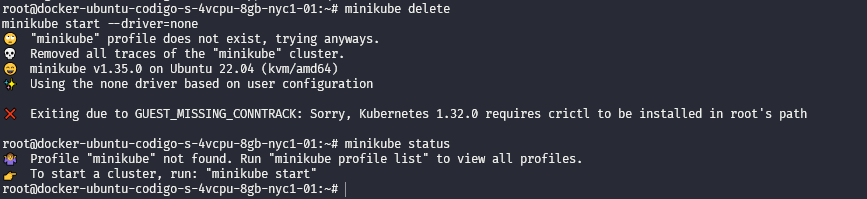

```
VERSION="v1.28.0"  # Puedes cambiar esto a la última versión estable
curl -LO https://github.com/kubernetes-sigs/cri-tools/releases/download/$VERSION/crictl-$VERSION-linux-amd64.tar.gz
sudo tar -C /usr/local/bin -xzvf crictl-$VERSION-linux-amd64.tar.gz
rm crictl-$VERSION-linux-amd64.tar.gz

Después de instalar, verifica que crictl está disponible:
crictl --version

minikube start --driver=none
😄  minikube v1.35.0 on Ubuntu 22.04 (kvm/amd64)
✨  Using the none driver based on user configuration
👍  Starting "minikube" primary control-plane node in "minikube" cluster
🤹  Running on localhost (CPUs=4, Memory=7937MB, Disk=158599MB) ...

🐳  Exiting due to NOT_FOUND_CRI_DOCKERD:
```
```
git clone https://github.com/Mirantis/cri-dockerd.git
cd cri-dockerd
mkdir bin
go build -o bin/cri-dockerd
sudo apt update
sudo apt install -y golang-go
go build -o bin/cri-dockerd

sudo apt update
sudo apt install -y golang-go
```

me doy cuenta que no es necesario activar la funciaonlidad de --driver que en miniube define cómo se ejecutará Kubernetes en tu máquina. Básicamente, indica qué backend de virtualización o contenedores usará para ejecutar el clúster de Kubernetes.

> [!NOTE]
> --driver define cómo ejecutará Kubernetes en Minikube.

Usa docker si ya tienes Docker.
Usa none si estás en un servidor como Digital Ocean.
Usa kvm2 en Linux si tienes virtualización.
Usa virtualbox en Windows/macOS si no tienes Docker.
En ese orden de ideas inicializo nimikube sin especificar --driver
```
minikube start
```
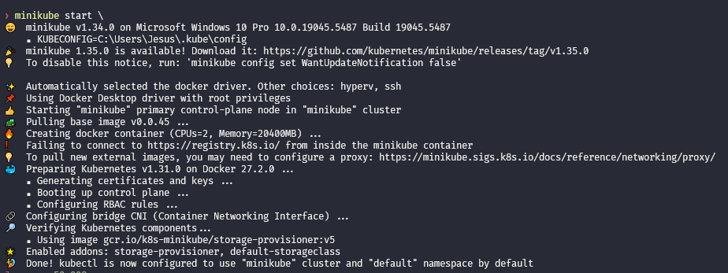


### 2. 📌Agrego estructura de directorios para .github/workflows (actions) y 
```
📁 backend-dynamic-db
│   ├── .github/
│   │   └── workflows/
│   │       └── deploy.yml     # GitHub Actions para desplegar en Kubernetes
│   ├── k8s/                   # Archivos YAML para Kubernetes
│   │   ├── namespace.yaml      # Define el namespace
│   │   ├── configmap.yaml      # Variables de entorno
│   │   ├── secret.yaml         # Credenciales de la DB
│   │   ├── deployment.yaml     # Despliegue del backend con 2 pods
│   │   ├── service.yaml        # Expone el backend en el clúster
│   │   ├── cronjob-backup.yaml # Tarea programada para respaldos de la DB
│   ├── Dockerfile              # Archivo para construir la imagen de Docker
│   ├── package.json            # Dependencias de Node.js
│   ├── index.js                # Código del backend
│   ├── README.md               # Documentación
│   ├── .dockerignore           # Archivos a ignorar en la imagen de Docker
│   ├── docker-compose.yml      # Opcional: Para pruebas locales con Docker
```

Me conecto a Digital Ocean
```
 ssh root@204.48.22.13
```

Instalo el comando tree
```
 apt install tree
```

hago un 
```
tree codigo
codigo
├── alejandrorios
├── crizsanchez
├── jesusramirez
├── pablogiraldo
├── paulgiraldo
└── pavelpenna
```

INgreso a mi directorio :
```
cd codigo
cd jesusramirez
```

Dado que deseo organizar mejor los servicios dentro del directorio: codigo/jesusramirez , utilizo un subdirectorio backend-dynamic-db/ dentro de /root/codigo/jesusramirez/ para gestionar el despliegue del backend y permitir la creación de otros servicios en el futuro.
```
📁 /root/codigo/jesusramirez/
│   ├── backend-dynamic-db/     # 📌 Directorio exclusivo para el backend
│   │   ├── k8s/                # 📌 Archivos YAML para Kubernetes
│   │   │   ├── namespace.yaml      # Define el namespace
│   │   │   ├── configmap.yaml      # Variables de entorno
│   │   │   ├── secret.yaml         # Credenciales de la DB
│   │   │   ├── deployment.yaml     # Despliegue del backend con 2 pods
│   │   │   ├── service.yaml        # Expone el backend en el clúster
│   │   │   ├── cronjob-backup.yaml # Tarea programada para respaldos de la DB
│   │   ├── .github/workflows/      # CI/CD con GitHub Actions
│   │   ├── Dockerfile              # Archivo para construir la imagen de Docker
│   │   ├── package.json            # Dependencias de Node.js
│   │   ├── index.js                # Código del backend
│   │   ├── README.md               # Documentación
│   │   ├── .dockerignore           # Archivos a ignorar en la imagen de Docker
│   │   ├── docker-compose.yml      # Opcional: Para pruebas locales con Docker
```

en el proyecto sobre el directorio .github/workflows creo el archivo deploy.yml
me doy cuenta que necesito ciertos datos de configuracion en secrets actions como el token de acceso de docker-hub, en setting / personal access token

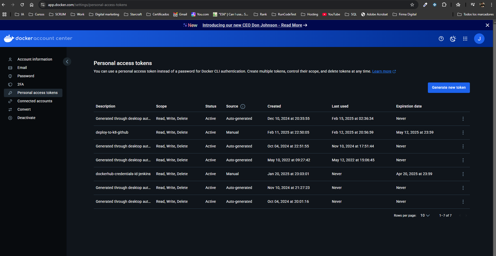

Creo en settings de mi proyecto github : Secrets and Variables/Actions :
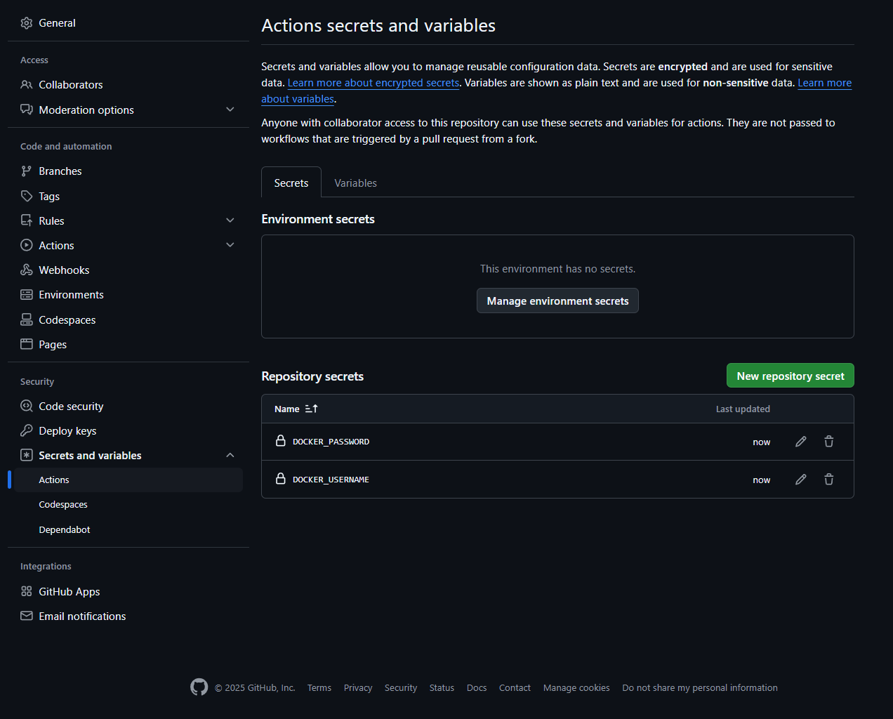

sin embargo caigo en cuenta que necesito el token privado de digital Ocean para lo cual ingreso a digital ocean

```
ssh root@204.48.22.13
```

ingreso a :
```
cat ~/.ssh/id_rsa
```
Creo el rsa utilizando mi email personal
```
ssh-keygen -t rsa -b 4096 -C "luciojesusramirezgamarra@gmail.com"
```
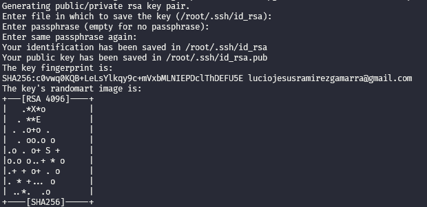

obtengo la llave privada la copio y regreso para agregarla en github como Secrets and Variables/Actions :
```
cat ~/.ssh/id_rsa
```

quedando de esta manera :

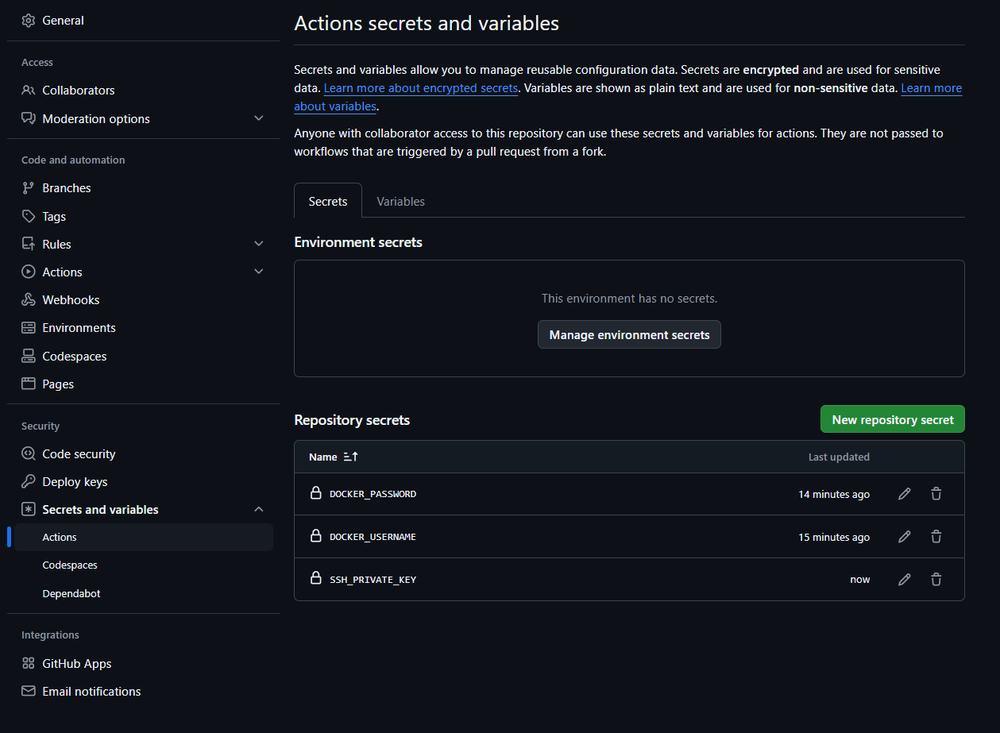


actualizo deploy.yml en .github/workflows/

```
name: Deploy Backend to Kubernetes

on:
  push:
    branches:
      - develop  # 🚀 Se ejecutará cuando haya cambios en la rama "develop"

jobs:
  deploy:
    runs-on: ubuntu-latest
    steps:
      - name: Checkout repository
        uses: actions/checkout@v3

      - name: Log in to Docker Hub
        uses: docker/login-action@v2
        with:
          username: ${{ secrets.DOCKER_USERNAME }}
          password: ${{ secrets.DOCKER_PASSWORD }}

      - name: Build and push Docker image
        run: |
          docker build -t jesusramirezgamarra/backend-dynamic-db:latest .
          docker push jesusramirezgamarra/backend-dynamic-db:latest

      - name: Set up Kubectl
        uses: azure/setup-kubectl@v3
        with:
          version: v1.25.0

      - name: Authenticate with SSH
        uses: appleboy/ssh-action@master
        with:
          host: "204.48.22.13"
          username: "root"
          key: "${{ secrets.SSH_PRIVATE_KEY }}"
          script: |
            echo "📌 Conectado al servidor Digital Ocean"
            cd /root/codigo/jesusramirez/backend-dynamic-db/
            echo "📌 Aplicando Configuración en Kubernetes"
            kubectl apply -f k8s/namespace.yaml
            kubectl apply -f k8s/configmap.yaml
            kubectl apply -f k8s/secret.yaml
            kubectl apply -f k8s/deployment.yaml
            kubectl apply -f k8s/service.yaml
            kubectl apply -f k8s/cronjob-backup.yaml
            echo "🚀 Despliegue Completado en Kubernetes"
```

voy a terminar y pruebo
```
git add .github/workflows/deploy.yml
git commit -m "UPDATE  --- TEST k8s en GitHub Actions"
git push origin develop
```

Visualizo el error : el cual me indica la naturaleza del error : 
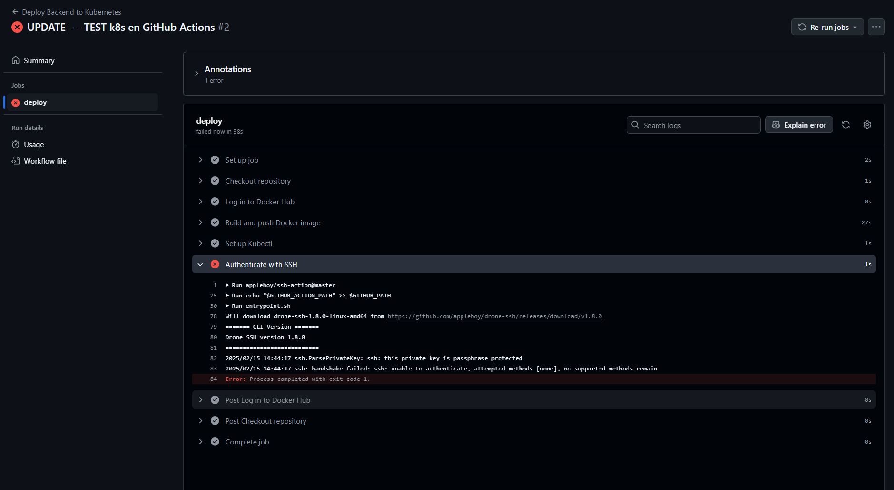

Como este error esta realcionado con el Passphase tengo como opcion generar nuevamente un rsa privado sin considerar un passphrase o enviar este valor en mi deploy.yml .
Agrego SSH_PRIVATE_KEY

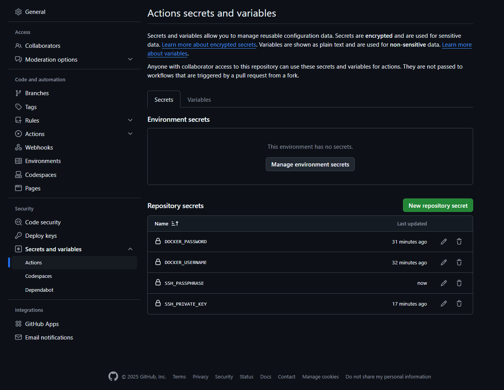

Modifico el archivo deploy.yml para aregar el uso de expect y ademas usar el secret : SSH_PRIVATE_KEY para pasar el valor.

```
name: Deploy Backend to Kubernetes

on:
  push:
    branches:
      - develop  # 🚀 Se ejecutará cuando haya cambios en la rama "develop"

jobs:
  deploy:
    runs-on: ubuntu-latest
    steps:
      - name: Clonar repositorio
        uses: actions/checkout@v4

      - name: Instalar `expect`
        run: sudo apt-get update && sudo apt-get install -y expect

      - name: Configurar SSH y conectar al servidor con `expect`
        run: |
          mkdir -p ~/.ssh
          echo "${{ secrets.SSH_PRIVATE_KEY }}" > ~/.ssh/id_rsa
          chmod 600 ~/.ssh/id_rsa
          ssh-keyscan -H -t rsa 204.48.22.13 >> ~/.ssh/known_hosts

      - name: Probar conexión SSH con `expect`
        run: |
          expect <<EOF
          spawn ssh -o StrictHostKeyChecking=no -i ~/.ssh/id_rsa root@204.48.22.13 "echo Conexión exitosa!"
          expect "Enter passphrase for key"
          send "${{ secrets.SSH_PASSPHRASE }}\r"
          expect eof
          EOF

      - name: Sincronizar archivos Kubernetes con el servidor usando `expect`
        run: |
          expect <<EOF
          spawn rsync -avz --delete -e "ssh -o StrictHostKeyChecking=no -i ~/.ssh/id_rsa" ./k8s/ root@204.48.22.13:/root/codigo/jesusramirez/backend-dynamic-db/k8s
          expect "Enter passphrase for key"
          send "${{ secrets.SSH_PASSPHRASE }}\r"
          expect eof
          EOF

      - name: Conectar al servidor y desplegar en Kubernetes con `expect`
        run: |
          expect <<EOF
          spawn ssh -o StrictHostKeyChecking=no -i ~/.ssh/id_rsa root@204.48.22.13
          expect "Enter passphrase for key"
          send "${{ secrets.SSH_PASSPHRASE }}\r"
          expect "#"
          send "cd /root/codigo/jesusramirez/backend-dynamic-db/k8s\r"
          send "kubectl apply -f namespace.yaml\r"
          send "kubectl apply -f configmap.yaml\r"
          send "kubectl apply -f secret.yaml\r"
          send "kubectl apply -f deployment.yaml\r"
          send "kubectl apply -f service.yaml\r"
          send "kubectl apply -f cronjob-backup.yaml\r"
          send "exit\r"
          expect eof
          EOF

      - name: Verificar estado de los pods en Kubernetes usando `expect`
        run: |
          expect <<EOF
          spawn ssh -o StrictHostKeyChecking=no -i ~/.ssh/id_rsa root@204.48.22.13 "kubectl get pods -n backend-namespace"
          expect "Enter passphrase for key"
          send "${{ secrets.SSH_PASSPHRASE }}\r"
          expect eof
          EOF
```


