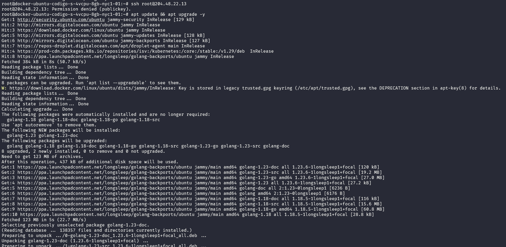
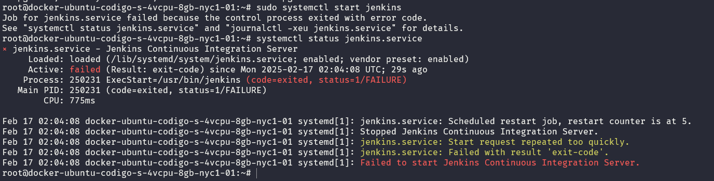
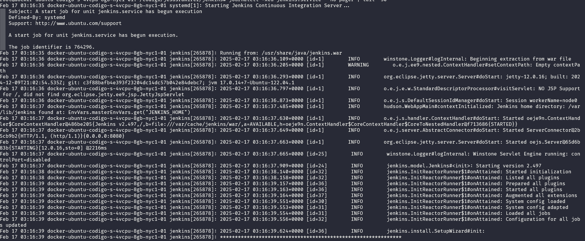
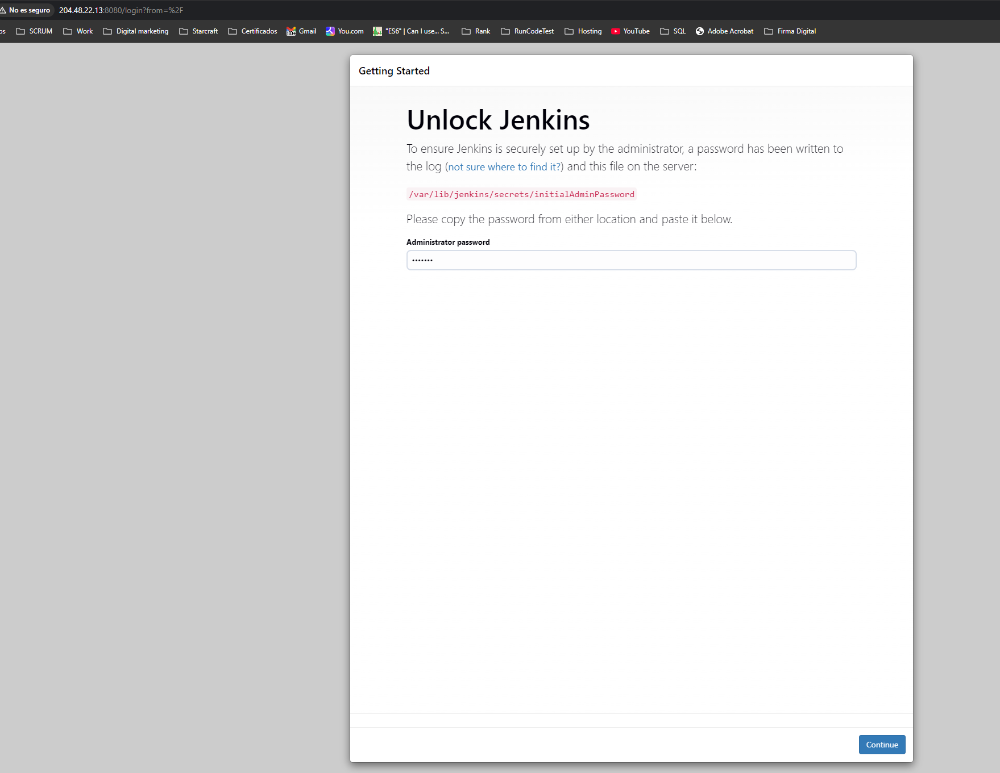
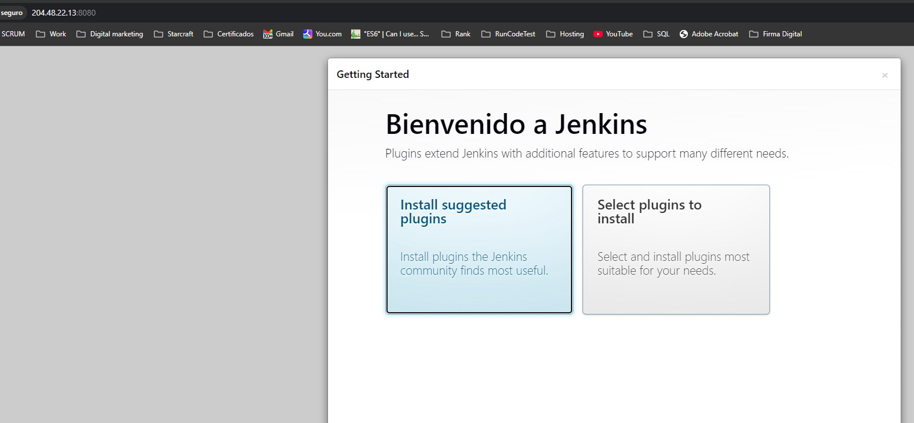
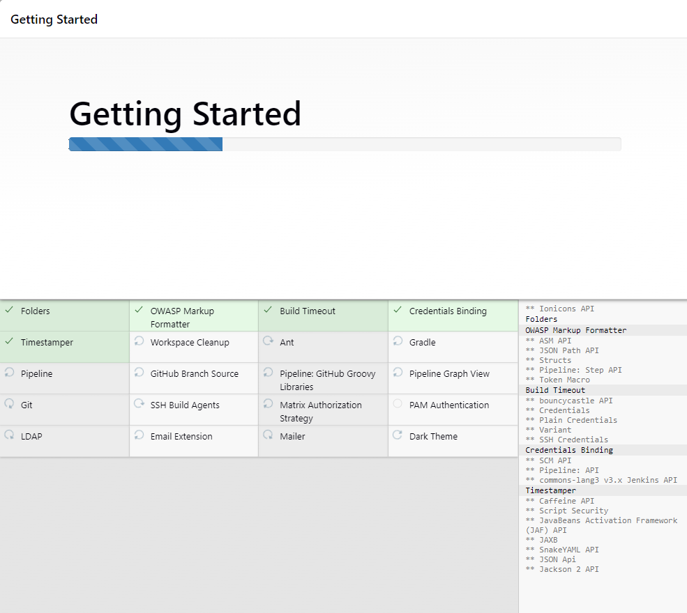
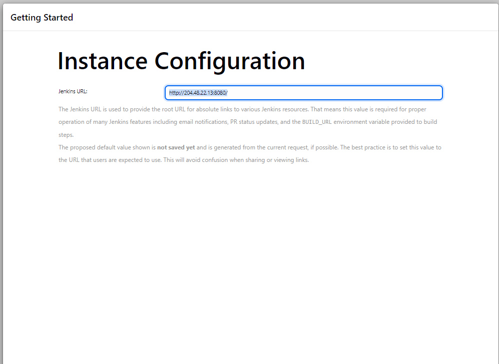
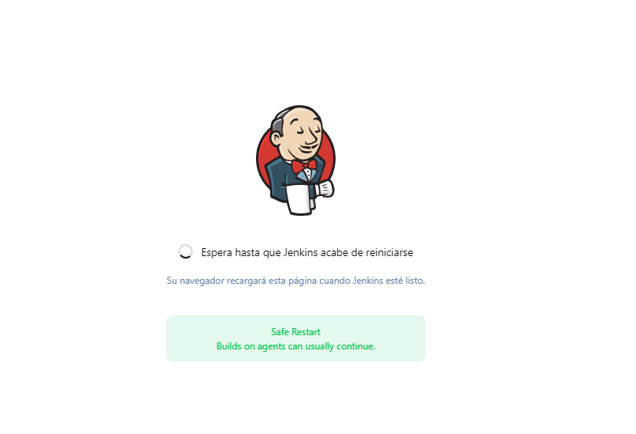
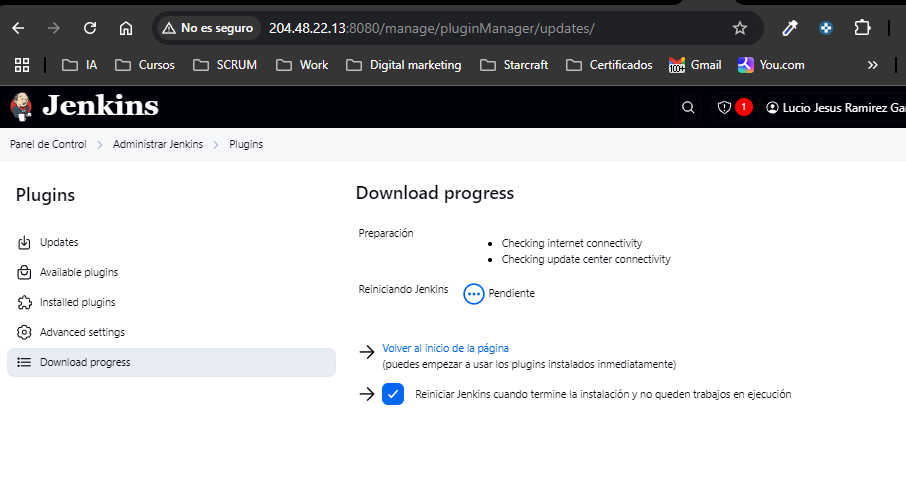

# 1. Instalacion de Jenkins en digital Ocean


Actualizar los paquetes del sistema:
```
apt update && apt upgrade -y
```


Agregar la clave GPG de Jenkins:
Jenkins requiere una clave GPG para verificar los paquetes descargados. Para agregarla, ejecuta:
```
wget -q -O - https://pkg.jenkins.io/ci.org.key | sudo apt-key add -
```

El error que estás viendo indica que apt-key está obsoleto y que el archivo proporcionado no contiene datos de clave válidos. Para corregirlo, sigue estos pasos para agregar la clave de manera compatible con las versiones más recientes de Ubuntu/Debia
```
wget -O /usr/share/keyrings/jenkins-keyring.asc https://pkg.jenkins.io/debian/jenkins.io-2023.key

```
Finalmente, actualiza el índice de paquetes e instala Jenkins:


Instalar Java (dependencia de Jenkins):
Jenkins requiere Java para ejecutarse. Puedes instalar OpenJDK 11 (una versión recomendada) con:
```
sudo apt install openjdk-11-jdk -y
```

```
sudo apt update
sudo apt install jenkins -y

```

niciar Jenkins:
```
sudo systemctl start jenkins
```


Ejecuta el siguiente comando para obtener detalles sobre el error:
```
systemctl status jenkins.service
```



```
sudo apt update
sudo apt install openjdk-17-jdk -y
```

Ejecuto :
```
 wget -O /usr/share/keyrings/jenkins-keyring.asc https://pkg.jenkins.io/debian/jenkins.io-2023.key
--2025-02-17 03:13:24--  https://pkg.jenkins.io/debian/jenkins.io-2023.key
```

Reinicio servicios
```
 sudo systemctl restart jenkins
 ```

verifico errores:
```
 journalctl -xeu jenkins.service --no-pager | tail -50
 ```
 

Inicializo Jenkin-- utilizare de password :
123123
 

 

 

 


 

 